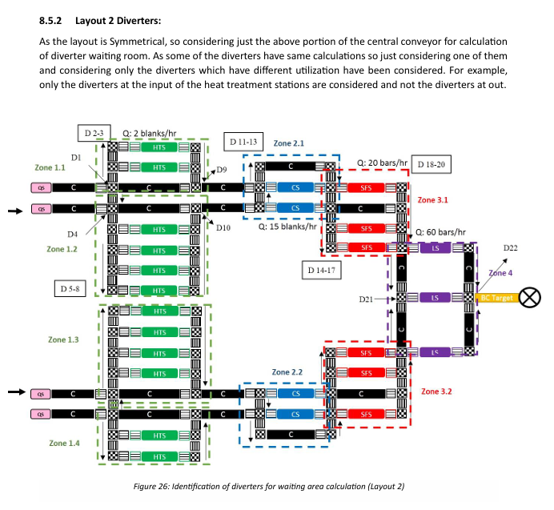
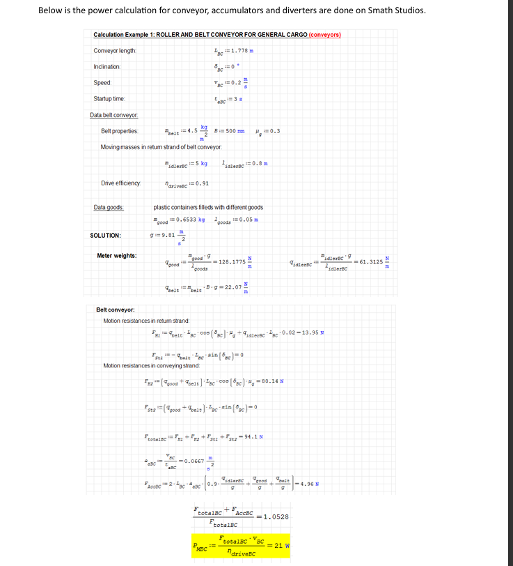

# Digitalization & Automation of Material Handling Systems (DAMHS)

  
  
  
  

**One-liner:** Concept, sizing, and evaluation of an automated material handling system with layout alternatives, sensors, buffers, and KPI-driven throughput analysis.

---

## ⭐ STAR Summary

**Situation**  
The post-processing line required higher, stable throughput while avoiding overload at critical stations.

**Task**  
Design an automated material handling concept that reaches ~**90 bars/hour** and improves flow reliability via the right combination of conveyors, diverters, sensors, and buffer sizing.

**Action**  
- Developed and compared multiple layout alternatives (flow paths, merge/divert logic).  
- Selected handling components (conveyors, diverters, accumulators) and placed sensors/inspection points.  
- Calculated machine counts, waiting elements, and buffer capacities; analyzed utilization and throughput.  

**Result**  
- **Target throughput (~90 bars/hour) achieved** in the selected concept.  
- Reduced risk of bottlenecks by keeping critical machines below 100% utilization.  
- Clear sizing rules for equipment and buffers to support reliable operation.

---

## 📐 System Design & Architecture

  
   
  <em>Figure 1: Final system layout with main stations, central conveyor, and buffer zones</em>

  
   
  <em>Figure 2: Handling Subsystems — Layout 1 illustrating diverters, conveyors, and buffers for automated material flow</em>

---

## 📊 Engineering Calculations

  
   
  <em>Figure 3: ⚡ Power Calculations — Dimensioning of conveyors, accumulators, and diverters performed in SMath Studio</em>

Key takeaways:  
- System throughput validated at ~90 bars/hour.  
- Buffer capacity sized to stabilize flow and reduce machine overload.  
- Power requirements calculated for conveyors, accumulators, and diverters to confirm feasibility.

---

## 📑 Report (PDF)

- [📥 Download Full Report (PDF)](docs/reports/DAMHS_Final.pdf)

---

## 📂 Repository Structure

