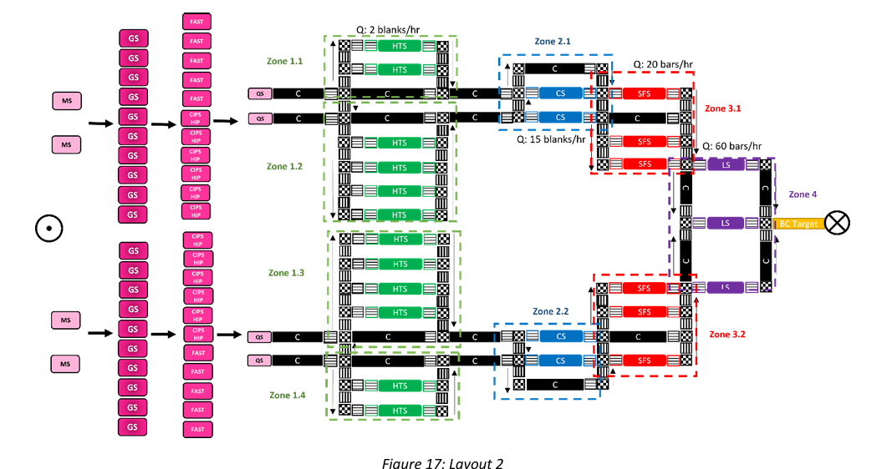
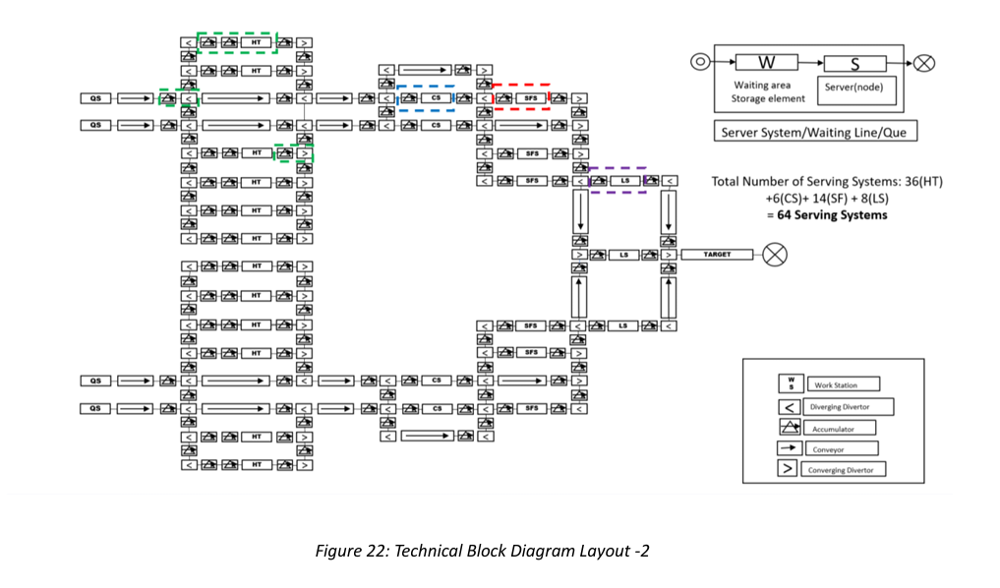
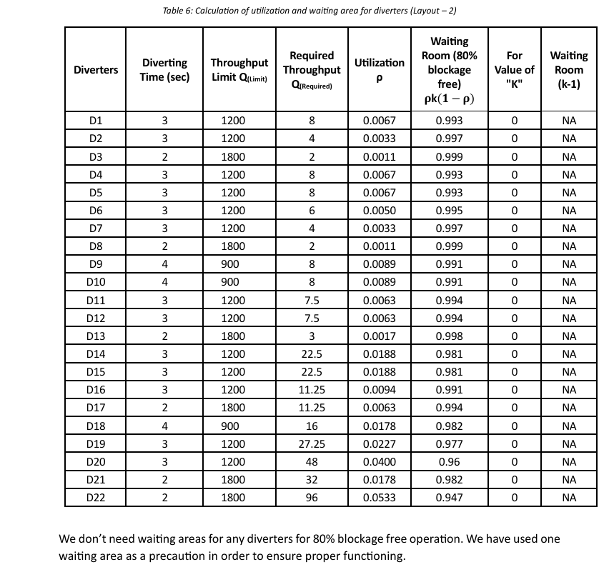

# Digitalization & Automation of Material Handling Systems (DAMHS)

  
  
  

Design & evaluation of an automated material handling system for a post-processing line.  
Focused on **conveyors, diverters, buffers, sensors/cameras, and KPI-driven simulation**.  
Target: **90 bars/hour throughput** with improved reliability.  

---

## ⭐ Project Summary (STAR)

**A) Situation**  
Post-processing line required higher throughput but suffered from bottlenecks at critical stations.  

**B) Task**  
Design an automated material handling system with conveyors, diverters, and sensors that ensures ~90 bars/hour without overloading machines.  

**C) Action**  
- Modeled multiple alternative layouts and simulated performance.  
- Selected conveyors, diverters, and accumulators; integrated sensors & camera checks.  
- Evaluated throughput, utilization, and waiting elements; optimized buffer sizes.  

**D) Result**  
- Achieved **90 bars/hour** throughput.  
- Reduced machine overload by balancing utilization.  
- Delivered a scalable, reliable automation concept for manufacturing.  

---

## 🖼️ Key Figures

### 1. System Layout  
  
*Final post-processing layout with central conveyor and buffer zones.*  

### 2. Handling Components  
  
*Selected conveyors, diverters, and sensors for automated handling.*  

### 3. KPI – Throughput Target  
  
*Simulation results validating throughput target of 90 bars/hour.*  

---

## 📑 Report  
[📥 Download Full Report (PDF)](docs/reports/DAMHS_Final.pdf)  

---

## 📂 Repository Structure  

